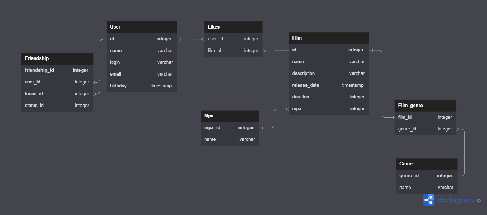

# java-filmorate

# Описание проекта
В данном проекте реализовано приложение Filmorate на Spring Boot.

В приложении есть возможность создавать, редактировать пользователей, а также получать список всех пользователей.
Также есть возможность создавать, редактировать фильмы, а также получать список всех фильмов. Пользователь может
поставить лайк фильму, а также удалить лайк у фильма. Можно добавить пользователя в друзья (данная операция
автоматически взаимная), удалить из друзей, а также получить список общих друзей двух пользователей и топ фильмов
по количеству лайков.

Взаимодействие с приложением происходит по API.  
Методы для работы с пользователями:  
POST /users - создание пользователя  
PUT /users - редактирование пользователя  
GET /users - получение списка всех пользователей  
GET /users/{userId} - получение информации о пользователе по его id  
PUT /users/{userId}/friends/{friendId} - добавление пользователя в друзья другому пользователю  
DELETE /users/{userId}/friends/{friendId} - удаление пользователя из друзей другого пользователя  
GET /users/{userId}/friends - получение списка друзей пользователя  
GET /users/{userId}/friends/common/{otherUserId} - получение списка общих друзей двух пользователей

Методы для работы с фильмами:  
POST /films - создание фильма  
PUT /films - редактирование фильма  
GET /films - получение списка всех фильмов  
GET /films/{filmId} - получение информации о фильме по его id  
PUT /films/{filmId}/like/{userId} - проставление лайку фильму пользователем  
DELETE /films/{filmId}/like/{userId} - удаление лайка у фильма пользователем  
GET /films/popular - получение топа самых популярных фильмов по количеству лайков (если у двух фильмов одинаковое
количество лайков, то они сортируются по имени)

Для создания и редактирования пользователя добавлены валидационные правила:
- электронная почта не может быть пустой и должна содержать символ @
- логин не может быть пустым и содержать пробелы
- имя для отображения может быть пустым (в таком случае будет использован логин)
- дата рождения не может быть в будущем

Для создания и редактирования фильма добавлены валидационные правила:
- название не может быть пустым
- максимальная длина описание - 200 символов
- дата релиза - не раньше 29 декабря 1895 года
- продолжительность фильма должна быть положительной
- рейтинг фильма не может быть пустым

В приложении добавлено логирование запросов, а также логирование исключений при некорректных входящих данных.

# Database diagram

## Примеры SQL-запросов в БД

Примерный запрос для получения всех фильмов

SELECT F.ID, F.NAME, F.DESCRIPTION, F.RELEASE_DATE, F.DURATION, M.MPA_ID,
M.NAME AS MPA_NAME, M.DESCRIPTION  AS MPA_DESCRIPTION
FROM FILMS AS F
JOIN MPA AS M ON F.MPA_ID = M.MPA_ID;

Примерный запрос для получения всех пользователей

SELECT * 
FROM users;
